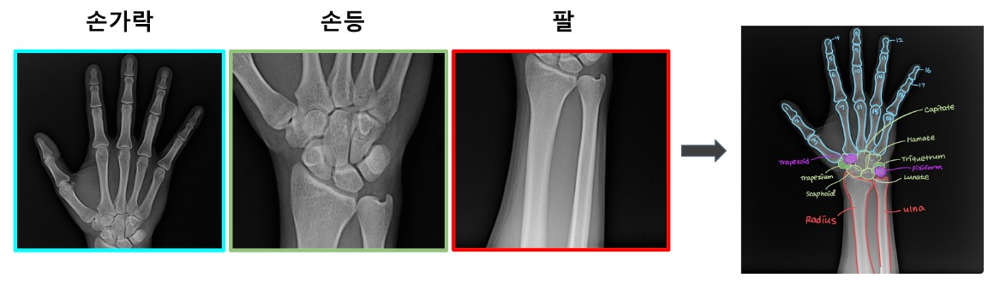
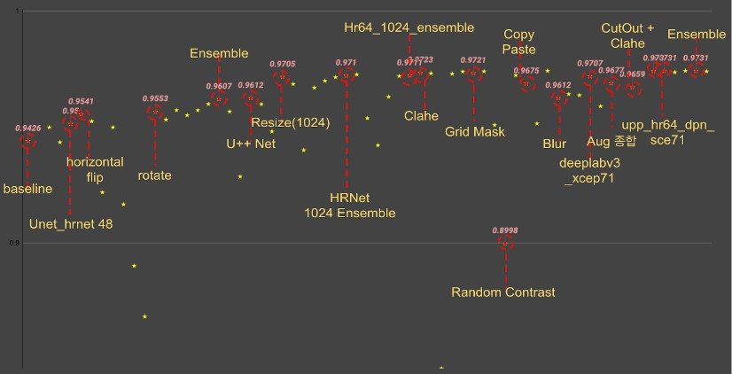
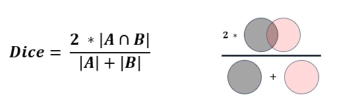

## 🦴Overview

뼈는 우리 몸의 구조와 기능에 중요한 영향을 미치기 때문에, 정확한 뼈 분할은 의료 진단 및 치료 계획을 개발하는 데 필수적입니다.

Bone Segmentation은 인공지능 분야에서 중요한 응용 분야 중 하나로, 특히, 딥러닝 기술을 이용한 뼈 Segmentation은 많은 연구가 이루어지고 있으며, 다양한 목적으로 도움을 줄 수 있습니다.
  여러분에 의해 만들어진 우수한 성능의 모델은 질병 진단, 수술 계획, 의료 장비 제작, 의료 교육 등에 사용될 수 있을 것으로 기대됩니다. 🌎

## 🧙‍♂️Team

|                                                                           [김지현](https://github.com/codehyunn)                                                                           |                                                                           [박상필](https://github.com/SangphilPark)                                                                           |                                                                           [오동혁](https://github.com/97DongHyeokOH)                                                                           |                                                                           [이상민](https://github.com/dldltkdals)                                                                           |                                                                           [이태순](https://github.com/LTSGOD)                                                                           |
| :--------------------------------------------------------------------------------------------------------------------------------------------------------: | :--------------------------------------------------------------------------------------------------------------------------------------------------------: | :--------------------------------------------------------------------------------------------------------------------------------------------------------: | :--------------------------------------------------------------------------------------------------------------------------------------------------------: | :--------------------------------------------------------------------------------------------------------------------------------------------------------: |
|  |  |  |  |  |

## 🏆LB Score

- private : 0.9731 (5등 / 19팀)
- public : 0.9736 (4등 / 19팀)

## ⭐Project Summary

- EDA: Test dataset에서 손을 45도 꺾은 데이터, 손가락 가장자리 부분의 경계선이 희미한 현상, 뼈 텍스처 특징 상 뼈 내부를 배경으로 예측하는 노이즈 발견
- 다양한 모델 실험: Unet, Unet++, deeplabV3, Segformer등의 모델 적용
- Augmentation: Resize, RandomContrast, CLAHE, Rotate 등 적용
- TTA: Horizontal flip 적용
- Ensemble : Hard Vote, Soft Vote 앙상블 적용

| Dataset no. |    Model   |        Encoder        |     Augmentation     | TTA (h_flip) | Valid Dice Score | LB Score (Dice) |
|:-----------:|:----------:|:---------------------:|:--------------------:|:------------:|:----------------:|:---------------:|
|      0      |   UNet++   |       HRNet w64       |       rotate 30      |       O      |      0.9691      |      0.9705     |
|      0      |   UNet++   |       HRNet w64       |       rotate 30      |       X      |      0.9691      |      0.9673     |
|      1      |   UNet++   |       HRNet w64       | rotate 30, grid mask |       O      |      0.9841      |      0.9723     |
|      2      |   UNet++   |       HRNet w64       |       rotate 30      |       X      |       0.982      |      0.9703     |
|      3      |   UNet++   |       HRNet w64       |       grid mask      |       O      |      0.9829      |      0.9721     |
|      4      |   UNet++   |       HRNet w64       |           -          |       O      |      0.9763      |      0.9657     |
|      0      |  Segformer | MixVision Transformer |  Blur, CLAHE, cutout |       X      |      0.9698      |      0.9659     |
|   0,1,3,4   | DeepLabV3+ |       Xception71      | rotate 30, grid mask |       X      |         -        |      0.9710     |

## 📈Model performance

## 💾Datasets

- train: 800장의 train image 존재
- test: 300장의 test image 존재
- 이미지 크기: (2048, 2048) 3 channel
- 크게 손가락 / 손등 / 팔로 구성되며, 총 29개의 class (뼈 종류)가 존재
- 출처 : 부스트캠프 AI Tech

## 📊Metric
- Dice coefficient
  - Semantic Segmentation에서 사용되는 대표적인 성능 측정 방법

## ⚒Development Environment

- GPU : v100
- OS : linux
- library : pytorch